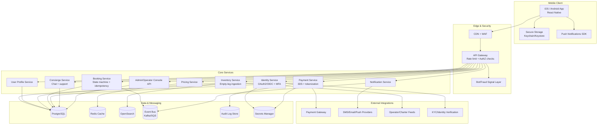

# Empty-Leg Jet Booking Mobile App
## Screen-by-Screen UX Specification + Technical Architecture Diagram

This document converts the previous blueprint into an actionable **mobile UX specification** and a **technical architecture diagram** for a luxury, secure empty-leg booking platform.

---

## 1) UX Foundation

### 1.1 Product goals
- Let users discover and book empty-leg flights in under 2 minutes.
- Deliver a concierge-grade, luxury feel in every interaction.
- Build visible trust through transparent, secure checkout and policies.

### 1.2 UX design principles
- **Luxury by restraint:** spacious layout, high-quality imagery, minimal clutter.
- **Fast decisions:** show only what users need for the next decision.
- **Trust-first:** security and policy disclosures embedded in flow, not hidden.
- **Personalized concierge tone:** context-aware suggestions and copy.

### 1.3 Visual system (mobile)
- **Colors:** Charcoal `#111315`, Ivory `#F7F3EA`, Platinum `#C8CBD1`, Gold accent `#B89B5E`.
- **Typography:**
  - Heading: high-contrast serif
  - Body/UI: clean sans-serif
- **Motion:** 120–220ms transitions, ease-out curves, subtle haptics at key actions.
- **Component style:** rounded cards, soft shadows, premium gradient overlays.

---

## 2) Primary User Flow Map

1. Splash → Onboarding → Sign in / Sign up
2. Home feed (personalized empty legs)
3. Search + filters
4. Flight details
5. Checkout step 1: traveler details
6. Checkout step 2: payment + confirmation
7. Booking success + itinerary + concierge CTA
8. Manage bookings / profile / membership / payments
9. Concierge chat and support

---

## 3) Screen-by-Screen UX Specification

> Legend: **Purpose**, **Key UI Blocks**, **Primary Actions**, **States/Edge Cases**, **Events to Track**

### Screen 01 — Splash & Brand Entry
**Purpose**
- Establish premium first impression and app trust.

**Key UI Blocks**
- Full-bleed cinematic aircraft image/video loop
- Brand lockup/logo
- Loading indicator + “Secured by enterprise-grade encryption” micro-copy

**Primary Actions**
- Auto-transition to onboarding/auth gate

**States / Edge Cases**
- Low bandwidth: static image fallback
- First launch only: show 2.5s animation max

**Events to Track**
- `splash_viewed`, `splash_to_onboarding_time`

---

### Screen 02 — Onboarding Carousel (3 cards)
**Purpose**
- Explain value quickly: luxury, flexibility, verified operators.

**Key UI Blocks**
- 3 cards:
  1) Discover premium empty legs
  2) Book in minutes
  3) Verified aircraft/operators
- Progress dots, Skip, Continue

**Primary Actions**
- Continue → Auth choice
- Skip → Auth choice

**States / Edge Cases**
- Returning users bypass onboarding

**Events to Track**
- `onboarding_started`, `onboarding_completed`, `onboarding_skipped`

---

### Screen 03 — Auth Gateway
**Purpose**
- Frictionless but secure entry.

**Key UI Blocks**
- Sign in methods: email, phone OTP, Apple/Google
- “Why verification matters” security note
- Terms & privacy links

**Primary Actions**
- Sign up / Sign in
- Trigger MFA enrollment after first successful auth

**States / Edge Cases**
- Suspicious login → step-up verification
- Locked account → support flow

**Events to Track**
- `auth_method_selected`, `login_success`, `login_failure`, `mfa_enrolled`

---

### Screen 04 — Home Feed (Personalized Empty Legs)
**Purpose**
- Show highest-likelihood-to-book flights immediately.

**Key UI Blocks**
- Top greeting with nearest airport context
- Search bar + quick filters chips (Today, Weekend, Pets, Wi-Fi)
- Flight cards (route, departure window, aircraft, seats, price)
- “Invite-only” deals carousel for tiered members

**Primary Actions**
- Tap flight card → Flight detail
- Tap filter/search → Search modal
- Save/watch route

**States / Edge Cases**
- Empty state: “No flights right now” + set alerts CTA
- Partial inventory outage: “Data refresh in progress”

**Events to Track**
- `feed_viewed`, `flight_card_opened`, `route_saved`, `filter_chip_used`

---

### Screen 05 — Search & Filter Modal
**Purpose**
- Enable fast narrowing without overwhelming users.

**Key UI Blocks**
- Origin/destination selectors (airport autocomplete)
- Date/time windows
- Cabin preferences, pets allowed, baggage minimum, Wi-Fi
- Sort controls (price, earliest departure, popularity)

**Primary Actions**
- Apply filters
- Save search alert
- Reset filters

**States / Edge Cases**
- No results: suggest nearby airport/date alternatives

**Events to Track**
- `search_executed`, `filters_applied`, `search_alert_created`, `no_results_seen`

---

### Screen 06 — Flight Detail
**Purpose**
- Convert interest into booking confidence.

**Key UI Blocks**
- Hero image + route map
- Price module (member price vs standard)
- Aircraft details (model, cabin, range, baggage, amenities)
- Operator verification badge + policy summary
- Cancellation and refund policy accordion

**Primary Actions**
- Book now
- Chat with concierge
- Save/watch this leg

**States / Edge Cases**
- Availability changed: inline real-time refresh banner
- Price changed: explicit delta explanation before continue

**Events to Track**
- `flight_detail_viewed`, `book_now_tapped`, `concierge_opened`, `price_change_seen`

---

### Screen 07 — Checkout Step 1 (Traveler Details)
**Purpose**
- Capture passengers and service preferences accurately.

**Key UI Blocks**
- Lead traveler + passenger list forms
- ID/passport requirements (where applicable)
- Special requests (catering, pets, accessibility)
- Contact confirmation

**Primary Actions**
- Continue to payment

**States / Edge Cases**
- Validation errors with inline guidance
- Passenger count exceeds seat count

**Events to Track**
- `checkout_started`, `traveler_info_completed`, `form_error`

---

### Screen 08 — Checkout Step 2 (Payment & Confirm)
**Purpose**
- Secure, transparent payment with confidence cues.

**Key UI Blocks**
- Fare breakdown (base, taxes/fees, concierge add-ons)
- Payment methods (card, bank request, wallet credits)
- Security row: PCI-compliant processing + 3DS + encryption note
- Confirm booking CTA

**Primary Actions**
- Pay and confirm

**States / Edge Cases**
- 3DS challenge flow
- Payment failure recovery with retry and alternate method
- Idempotent retry to prevent duplicate charge/order

**Events to Track**
- `payment_attempted`, `payment_3ds_started`, `payment_success`, `payment_failed`

---

### Screen 09 — Booking Success
**Purpose**
- Reassure completion and guide next actions.

**Key UI Blocks**
- Confirmation number + status chip
- Itinerary summary and downloadable documents
- Airport/FBO instructions
- “Message concierge” primary CTA

**Primary Actions**
- Add to calendar
- Download itinerary PDF
- Open concierge chat

**States / Edge Cases**
- Document generation delay: non-blocking notification

**Events to Track**
- `booking_confirmed`, `itinerary_downloaded`, `calendar_added`

---

### Screen 10 — My Trips
**Purpose**
- Manage upcoming and past bookings.

**Key UI Blocks**
- Upcoming / Past tabs
- Trip status timeline
- Cancel/reschedule request actions (policy aware)

**Primary Actions**
- Open trip details
- Submit cancellation/change request

**States / Edge Cases**
- Policy-limited changes: explain reasons and alternatives

**Events to Track**
- `trips_viewed`, `change_request_started`, `cancel_request_started`

---

### Screen 11 — Profile, Membership, Payment Methods
**Purpose**
- Manage account, loyalty, and trusted payment setup.

**Key UI Blocks**
- Profile and preferences (favorite airports, cabin/catering defaults)
- Membership tier card + benefits
- Saved payment methods and billing details
- Security center (MFA, active sessions, device list)

**Primary Actions**
- Update preferences
- Add/remove payment method
- Manage MFA/devices

**States / Edge Cases**
- High-risk changes require step-up auth

**Events to Track**
- `profile_updated`, `payment_method_added`, `mfa_updated`

---

### Screen 12 — Concierge Chat
**Purpose**
- Deliver white-glove support for high-value travelers.

**Key UI Blocks**
- Chat thread with SLA response indicator
- Rich cards: suggested alternate legs, add-ons, ground transfer
- Attachments (travel docs)

**Primary Actions**
- Send message
- Accept concierge recommendation

**States / Edge Cases**
- Offline: queue message and retry

**Events to Track**
- `chat_opened`, `message_sent`, `recommendation_accepted`

---

## 4) UX Copy & Trust Microcopy (examples)
- “Every operator is verification-checked before listing.”
- “Your payment is protected with 3D Secure and encrypted end-to-end.”
- “Availability is live and may change until booking is confirmed.”

---

## 5) Technical Architecture Diagram



---

## 6) Security Controls by Layer

### Mobile layer
- Device binding + risk scoring
- Secure token storage in OS-provided vaults
- Certificate pinning and jailbreak/root checks

### API & service layer
- JWT validation + RBAC/ABAC authorization
- Input schema validation on all write endpoints
- Idempotency keys for booking/payment operations

### Data layer
- AES-256 at rest, TLS 1.2+ in transit
- PII segregation + field-level encryption
- Immutable audit trails for booking/refund/profile/security actions

### DevSecOps layer
- SAST/DAST/dependency scanning in CI
- IaC scanning + secret detection
- Pre-release threat model and regular pentest cycles

---

## 7) Implementation Hand-off Checklist
- [ ] Figma files for 12 screens with variants (default/loading/error/empty)
- [ ] Design tokens exported (color/type/spacing/radius/motion)
- [ ] API contracts published (OpenAPI)
- [ ] Booking and payment state-machine approved
- [ ] Analytics taxonomy approved
- [ ] Security review checklist signed


---

## 8) How to Build This Locally in VS Code with Codex

This section gives you a practical local workflow so you can start coding immediately.

### 8.1 Prerequisites
- **OS:** macOS (recommended for iOS + Android), or Windows/Linux for Android-first.
- **Tools:**
  - VS Code (latest)
  - Node.js LTS (v20+ recommended)
  - Git
  - React Native toolchain (Android Studio + Xcode for macOS)
  - A package manager (`npm`, `pnpm`, or `yarn`)

### 8.2 Create project workspace
```bash
mkdir empty-leg-jet-app
cd empty-leg-jet-app
git init
```

### 8.3 Scaffold the mobile app (React Native + TypeScript)
```bash
npx @react-native-community/cli@latest init EmptyLegJet --template react-native-template-typescript
cd EmptyLegJet
```

### 8.4 Open in VS Code
```bash
code .
```

### 8.5 Recommended VS Code extensions
- ESLint
- Prettier
- React Native Tools
- Error Lens
- GitLens

### 8.6 Suggested project structure
```text
src/
  app/
    navigation/
    providers/
  features/
    auth/
    discovery/
    flight-detail/
    checkout/
    trips/
    profile/
    concierge/
  shared/
    components/
    theme/
    utils/
    api/
  analytics/
  security/
```

### 8.7 Install core libraries
```bash
npm install @react-navigation/native @react-navigation/native-stack
npm install @tanstack/react-query
npm install axios zod
npm install react-hook-form
npm install @react-native-async-storage/async-storage
```

> For secure token storage, use platform-secure storage (Keychain/Keystore) libraries rather than plain async storage for auth secrets.

### 8.8 Build the first 3 screens from this UX spec
Implement in this order:
1. Splash + onboarding
2. Auth gateway
3. Home feed

This gives you a fast vertical slice to validate:
- design tokens
- navigation patterns
- API integration shape
- analytics event wiring

### 8.9 API strategy for local development
- Start with a mock API server (or static JSON) for:
  - empty-leg feed
  - flight details
  - booking quote
- Define TypeScript models from OpenAPI early.
- Add request/response validation with `zod` on client boundaries.

### 8.10 Security baseline from day 1
- Enforce MFA in auth flow (even if mocked initially).
- Keep access tokens short-lived.
- Add refresh-token rotation on backend design.
- Implement idempotency key support in checkout requests.
- Never log sensitive PII/payment details in debug logs.

### 8.11 Example implementation backlog (first week)
- Day 1: project setup, lint/format, navigation shell
- Day 2: theme tokens (luxury palette/type/spacing)
- Day 3: onboarding + auth screens
- Day 4: home feed + filter modal UI
- Day 5: flight detail + analytics events + mock API wiring

### 8.12 How to use Codex effectively in VS Code
Use Codex for targeted prompts like:
- “Create React Native screen `FlightDetailScreen` using this UX block list and TypeScript interfaces.”
- “Generate a typed API client for empty-leg feed with axios + zod validation.”
- “Refactor checkout form into reusable components with react-hook-form.”
- “Add unit tests for pricing formatter and booking state transitions.”

Best practice:
- Ask for **small, reviewable changes**.
- Keep prompts tied to one screen or one service at a time.
- Require generated code to match your folder conventions.

### 8.13 Run locally
```bash
# Start Metro
npm start

# Android
npm run android

# iOS (macOS only)
npm run ios
```

### 8.14 Definition of Done for your MVP codebase
- [ ] 12 UX-specified screens implemented with loading/empty/error states
- [ ] Auth + MFA flow integrated
- [ ] Search/discovery + flight details + 2-step checkout functional
- [ ] Payment intent + 3DS flow wired in sandbox
- [ ] Analytics events implemented for all critical steps
- [ ] Security checklist in CI (lint, tests, dependency scan)

